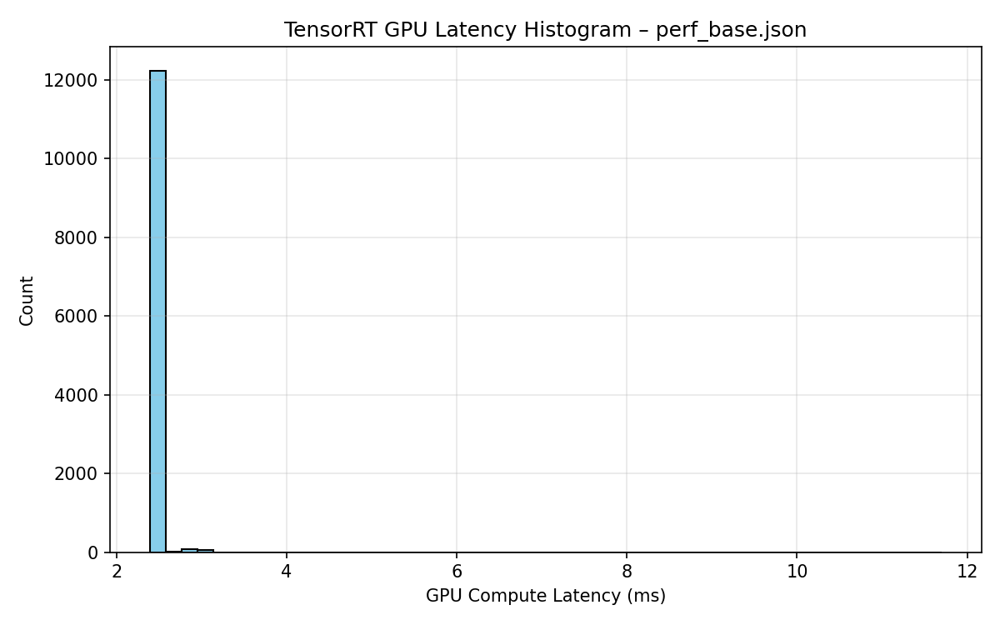
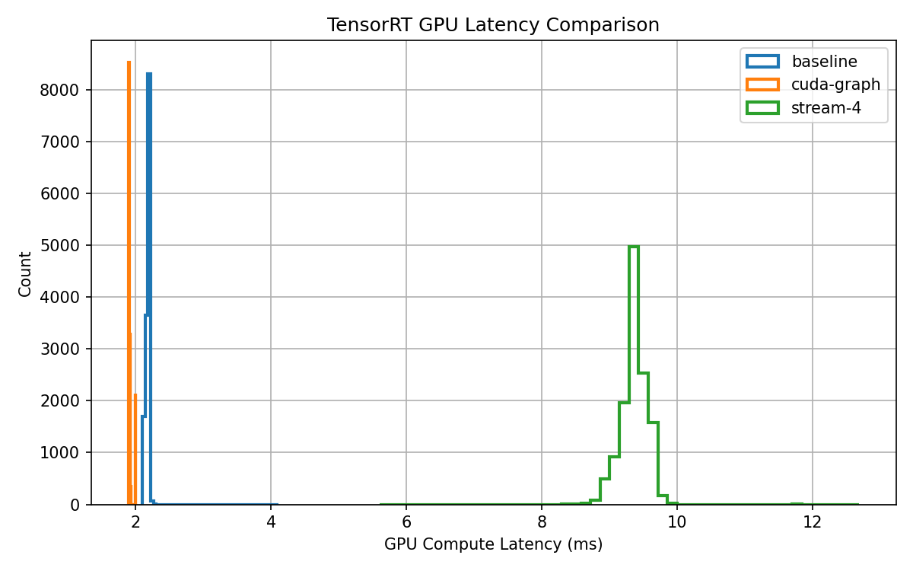

# TensorRT FP16 Inference Benchmark on Jetson Orin Nano

## Overview
This project is a deep dive into high-performance inference optimization on NVIDIA Jetson Orin Nano using TensorRT. I exported a ResNet-50 model to ONNX, built optimized FP16 TensorRT engines, and systematically benchmarked inference performance under multiple execution configurations including baseline execution, CUDA Graphs, and multi-stream scheduling. Using TensorRT’s detailed timing traces, I extracted per-inference GPU compute latency and analyzed throughput, average latency, and tail latency (p90/p99) across more than 13,000 runs. The results were visualized with latency histograms and comparison plots to highlight variance reduction and performance tradeoffs introduced by different optimization techniques. This project demonstrates practical skills in embedded GPU performance engineering, model deployment, and low-level inference profiling on edge AI hardware.

## Get The Model
wget https://download.pytorch.org/models/resnet50-0676ba61.pth
python export_onnx.py

## Pipeline
ONNX → TensorRT FP16 Engine → Benchmark (30s steady-state)

## Optimizations Evaluated
- FP16 precision
- Timing cache reuse
- CUDA Graph execution
- Multi-stream inference (2, 4 streams)

## Hardware
- NVIDIA Jetson Orin Nano
- TensorRT 10.3
- CUDA Compute Capability 8.7

## Results Summary
| Mode | Throughput (qps) | Mean Latency (ms) | p99 Latency (ms) |
|-----|------------------|-------------------|------------------|
| Base | ~458 | ~2.23 | ~2.24 |
| CUDA Graph | TBD | TBD | TBD |
| 2 Streams | TBD | TBD | TBD |
| 4 Streams | TBD | TBD | TBD |

## Key Takeaways
- FP16 provides sub-3ms inference latency
- CUDA Graph reduces CPU enqueue overhead
- Multi-stream execution improves throughput but may increase tail latency
- TensorRT timing cache significantly reduces rebuild time

## Reproducibility
All benchmarks can be reproduced using scripts in `/scripts`.

## Latency Analysis

Per-inference GPU compute latency was extracted directly from
TensorRT timing traces (`endComputeMs - startComputeMs`) across ~13k runs.

CUDA Graph and multi-stream execution show reduced variance and tighter
tail latency compared to baseline execution.

